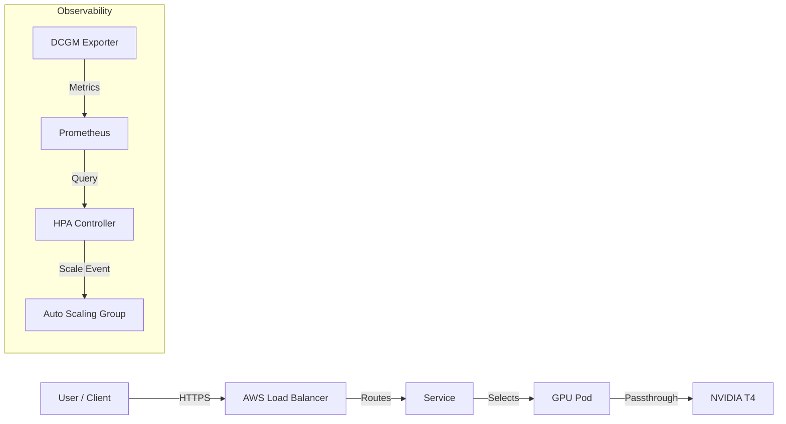

# Level 3: Advanced (The "Orchestrator")
## K8s GPU Cluster with Auto-Scaling & Monitoring

> **Status**: Production Ready / Architect Level
> **Focus**: Orchestration, Cost Efficiency, Observability
> **Author**: Senior Cloud Architect

---

## 1. Architectural Mindset

This project is not a simple container deployment. It is an **Orchestration Framework** for high-performance computing resources. In a cloud environment, managing GPUs requires precision—they are expensive resources that must be utilized efficiently.

### End-to-End Data Flow


**Key Concept**: We do not treat GPUs like CPUs. CPU scaling depends on generic load. GPU scaling in this architecture depends on specific `DCGM_FI_DEV_GPU_UTIL` metrics scraped directly from the hardware.

See [architecture/architecture.md](architecture/architecture.md) for the deep dive.

---

## 2. GPU-Oriented Kubernetes Setup

Standard Kubernetes does not natively understand "GPU Saturation". It only understands "Requests/Limits" allocation. To bridge this gap, we use:

1.  **NVIDIA Device Plugin**: A DaemonSet that informs the Kubelet about available GPU peripherals. This allows the syntax `nvidia.com/gpu: 1` in our manifests.
2.  **GPU Passthrough**: We map the physical PCIe device directly to the container to ensure minimal latency for CUDA instructions.

---

## 3. Monitoring & Observability (The Selling Point)

If you cannot measure it, you cannot manage it. And if you cannot manage it, you are burning money.

We implement a sophisticated stack:
*   **DCGM (Data Center GPU Manager)**: Extracts hardware-level telemetry.
*   **Key Metrics Tracked**:
    *   `DCGM_FI_DEV_GPU_UTIL`: The true load of the GPU core.
    *   `DCGM_FI_DEV_FB_USED`: Frame Buffer (VRAM) usage. *Critical for Large Language Models.*
    *   `DCGM_FI_DEV_GPU_TEMP`: Thermal throttling detection.

*Artifacts*: `monitoring/grafana-dashboard.json`.

---

## 4. Auto-Scaling Logic (HPA)

**Architectural Decision**: We reject CPU-based scaling for this workload.
Why? A model inference server can handle 100 requests (High CPU) but utilize only 10% GPU if the batch size is small. Conversely, 1 complex request might spike VRAM to 99% with Low CPU.

**Our Policy**: 
Scale UP when `DCGM_FI_DEV_GPU_UTIL > 80%`.
This ensures we only pay for additional hardware when the current hardware is genuinely saturated.

---

## 5. Cost Analysis

> [!IMPORTANT]
> **Cost Warning**: This architecture is estimated to cost **~$1.50 per hour** to run.

Running a GPU cluster carelessly is the fastest way to bankrupt a startup.
*   **Instance**: `g4dn.xlarge` (AWS)
*   **Optimization**: Use of T4 GPUs offers the best price/performance ratio for inference (vs Training).

Detailed breakdown available in: [cost-analysis/aws-cost-estimation.md](cost-analysis/aws-cost-estimation.md).

---

## 6. Deployment & Clean-Up

### Deploy
```bash
cd scripts
./deploy.sh
```

### Destroy (Critical)
```bash
cd scripts
./destroy.sh
```
**Professional Discipline**: "It works" is not done. "It is cleaned up" is done. Leaving resources running is unprofessional.

---

*Verified by Antigravity - Senior DevOps Architect*
